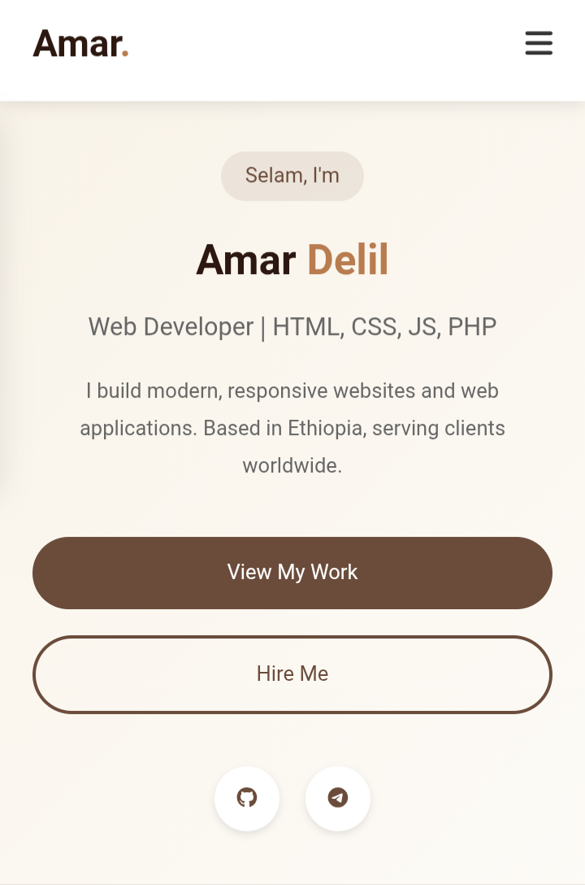
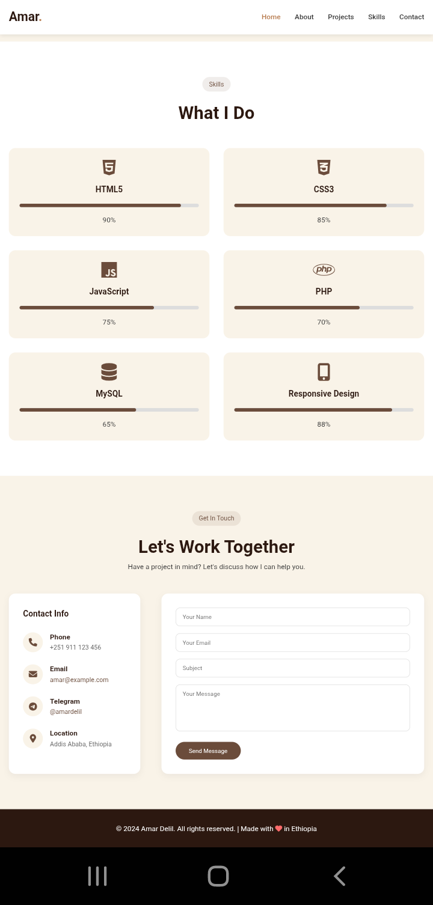

# ✦ Amar Delil – Personal Portfolio

[](https://github.com/amardelil/personalportfolio/commits/main)
[](https://github.com/amardelil/personalportfolio)
[](LICENSE)

> A modern, fully responsive personal portfolio website built with **HTML5**, **CSS3**, and **vanilla JavaScript**.  
> Showcases my projects, skills, and contact information with a clean, interactive interface.

🔗 **[View Live Demo →](https://amardelil.github.io/personalportfolio)**

---

## 📸 Screenshots

Here are some previews of the portfolio:

| Homepage Hero Section | Projects Showcase |
|:---------------------:|:-----------------:|
|  |  |

---

## 🛠️ Technologies Used

- ✅ **HTML5** – semantic structure
- ✅ **CSS3** – custom styling with responsive design
- ✅ **JavaScript (ES6)** – interactivity (menu toggle, smooth scroll, skill bars, form handling)
- ✅ **Font Awesome** – icons
- ✅ **GitHub Pages** – hosting

---

## 📁 Project Structure

```
personalportfolio/
├── index.html              # Main HTML file
├── portfoliostyle.css      # All styles
├── portfolioscript.js      # JavaScript interactions
├── images/                 # Screenshots & assets
│   ├── homepage.png        # Hero section preview
│   └── projects.png        # Projects section preview
└── README.md               # This file
```

---

## 🚀 How to Run Locally

1. **Clone** the repository:
   ```bash
   git clone https://github.com/amardelil/personalportfolio.git
   ```
2. Open `index.html` in any modern browser – no build tools required.

---

## 📬 Connect with Me

- **GitHub** – [amardelil](https://github.com/amardelil)
- **Telegram** – [@amardelil](https://t.me/+251992156362)
- **Email** – programmeramardelil21@gmail.com

---

## 📄 License

This project is open‑source and available under the [MIT License](LICENSE).

---

*Built with ❤️ by Amar Delil*
